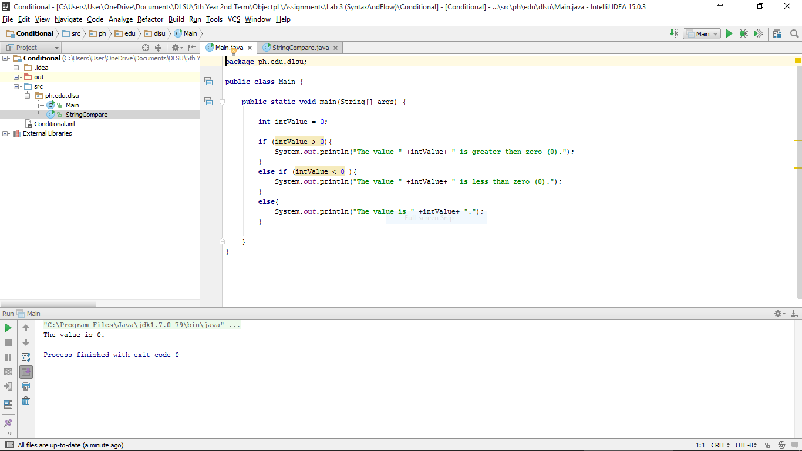
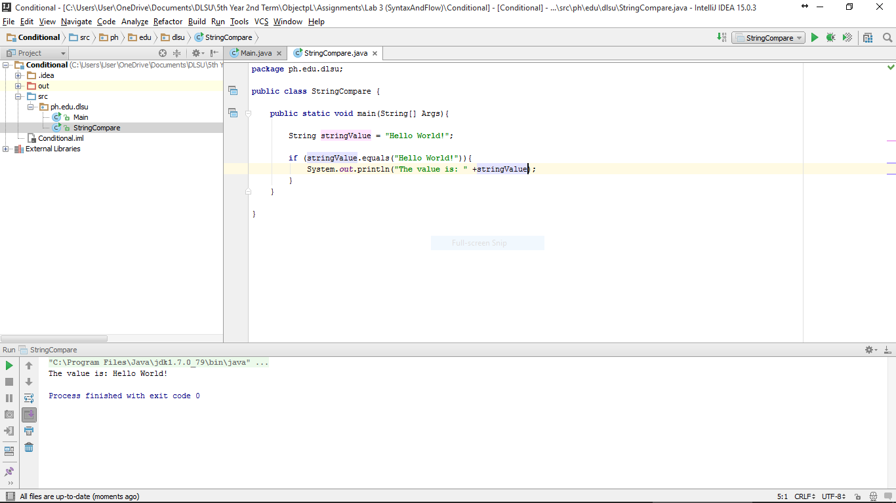

#Conditional

Trying if-else statements using primitives and complex data types.

#ScreenShots

#Codes

###Primitive
~~~
package ph.edu.dlsu;

public class Main {

    public static void main(String[] args) {

        int intValue = 0;

        if (intValue > 0){
            System.out.println("The value " +intValue+ " is greater then zero (0).");
        }
        else if (intValue < 0 ){
            System.out.println("The value " +intValue+ " is less than zero (0).");
        }
        else{
            System.out.println("The value is " +intValue+ ".");
        }

    }
}
~~~

###Complex
~~~
package ph.edu.dlsu;

public class StringCompare {

    public static void main(String[] Args){

        String stringValue = "Hello World!";

        if (stringValue.equals("Hello World!")){
            System.out.println("The value is: " +stringValue);
        }
    }

}

~~~
